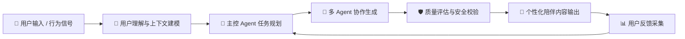
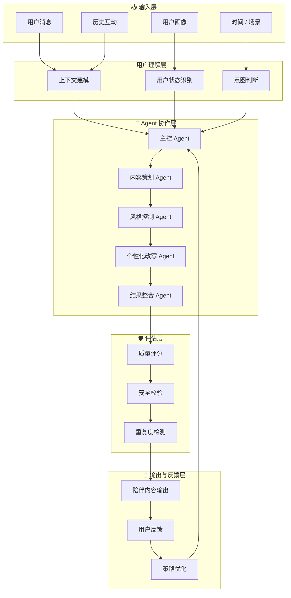

<h1 align="center">🌸 happyeveryday</h1>

<p align="center">
  <strong>智能陪伴与个性化内容生成 Agent 系统</strong>
</p>

<p align="center">
  <em>让 AI 不只是回复消息，而是理解用户、规划任务、生成内容、校验质量，并在反馈中持续变好。</em>
</p>

<p align="center">
  
  
  
  
  
</p>

---

## 🏷️ 项目定位

`happyeveryday` 是一套面向智能陪伴场景的 **个性化内容生成 Agent 系统**。

项目围绕“用户状态识别 → 任务拆解 → 内容生成 → 质量校验 → 反馈优化”构建完整链路，解决传统陪伴类产品在内容供给、用户理解和生成稳定性上的问题，让系统能够根据不同用户、不同场景、不同情绪状态，自动生成更自然、更贴合、更可持续优化的陪伴内容。

简单来说，它不是一个“调用一次大模型就结束”的聊天机器人，而是一套更接近真实业务落地的 Agent 工作流系统：

- 🌷 **理解用户**：结合用户画像、历史互动、近期行为和上下文状态。
- ✨ **规划任务**：先判断本次互动目标，再拆解生成路径。
- 🧠 **多 Agent 协作**：让不同 Agent 分别负责策划、风格、个性化改写和整合。
- 🛡️ **质量校验**：对相关性、一致性、重复度、场景适配度和安全风险进行检查。
- 🔁 **反馈优化**：根据点击、回复、停留、再次互动等行为持续调整策略。

---

## 🌟 项目背景

传统陪伴类产品通常依赖人工配置、固定模板或简单规则，在线上使用时会遇到几个明显问题：

| 痛点 | 具体表现 | happyeveryday 的思路 |
| --- | --- | --- |
| 内容生产效率低 | 文案依赖人工编写，更新慢，场景覆盖有限 | 通过 Agent 自动生成多场景陪伴内容 |
| 个性化不足 | 统一模板难以适应不同用户状态 | 引入用户画像、上下文建模和个性化改写 |
| 生成不稳定 | 单次大模型输出容易重复、跑偏、语气失真 | 使用多阶段生成、质量评估和策略约束 |
| 难以持续优化 | 输出结果缺少反馈闭环 | 根据用户互动行为反向优化生成策略 |

因此，本项目的重点不是简单“把模型接进来”，而是把生成过程工程化、模块化、可解释化和可调优化。

---

## 🧭 核心链路



### 1. 🌱 用户理解与上下文建模

系统会对用户基础画像、历史互动记录、近期活跃行为、时间场景、输入内容和上下文状态进行结构化整理，提取当前生成任务所需的关键信号。

例如，系统会判断当前更适合：

- 轻陪伴式回复
- 情绪安抚
- 日常鼓励
- 互动引导
- 话题延展
- 活跃召回

### 2. 🧠 任务规划与意图判断

主控 Agent 会根据用户状态和业务目标判断本次生成任务的方向，并进行中间决策：

- 本次内容目标是什么？
- 应该使用什么表达风格？
- 是否需要追问？
- 是否需要引导互动？
- 是否需要降低打扰感？

这一步让系统先“想清楚要做什么”，再进入生成环节，从而减少直接生成带来的不稳定问题。

### 3. 🤖 多 Agent 协作生成

内容生成过程被拆分为多个角色化 Agent：

| Agent 角色 | 职责 |
| --- | --- |
| 内容策划 Agent | 生成内容草案和表达方向 |
| 风格控制 Agent | 调整语气、措辞和互动感 |
| 个性化改写 Agent | 结合用户标签和历史偏好增强针对性 |
| 结果整合 Agent | 合并多路输出，形成最终候选结果 |

这种方式让生成链路从“单点输出”变成“协作生产”，提升了内容的一致性、稳定性和可控性。

### 4. 🛡️ 质量评估与安全校验

系统会对候选结果进行多维度检查：

- 相关性
- 上下文一致性
- 可读性
- 重复度
- 场景适配度
- 风险内容过滤

只有通过评估的内容才会进入最终输出，避免低质量、不合适或不稳定的生成结果直接触达用户。

### 5. 🔁 反馈学习与策略优化

系统会结合用户后续行为进行反馈分析，例如：

- 是否点击
- 是否回复
- 是否停留
- 是否再次互动
- 是否对某类表达更积极

这些反馈会反向影响任务规划、生成参数和表达策略，让系统不是一次性的静态输出，而是可以持续演进。

---

## 🧩 能力亮点

### 🌸 个性化陪伴内容生成

根据用户画像、兴趣偏好、活跃阶段、情绪状态和上下文场景，生成更贴合当前用户状态的陪伴内容。

### 🧠 长链路 Agent 推理

系统不是直接输出结果，而是先完成用户理解、任务拆解和表达策略判断，再进入生成流程。

### 🤖 多 Agent 协作机制

通过内容策划、风格控制、个性化改写和结果整合等 Agent 分工，让生成过程更稳定、更可管理。

### 🛡️ 质量评估与安全过滤

在内容触达前进行质量检查，降低重复、跑偏、语气不一致和场景不适配的问题。

### 📊 反馈驱动优化

通过用户互动数据沉淀策略经验，让系统能够持续优化生成效果。

### 📡 QQBot 消息接入

公开仓库保留了 QQBot 通道插件相关实现，用于展示消息入口、工具注册、配置治理和运行稳定性。

---

## 🏗️ 系统架构



---

## 🛠️ 工程实现

本公开仓库展示的是 `happyeveryday` 项目中可公开的 QQBot 通道插件部分，主要体现系统在真实消息入口和线上稳定性方面的工程能力。

### 已公开内容

- QQBot 通道插件入口
- OpenClaw 插件元数据
- QQBot 账号配置解析
- 群聊策略控制
- 请求上下文管理
- QQ Channel API 代理工具
- 定时提醒工具
- 富媒体技能说明
- 脱敏后的多日运行日志

### 关键能力

- **消息通道接入**：支持私聊、群聊、频道等 QQBot 场景。
- **工具化扩展**：将频道 API、提醒任务、媒体发送等能力封装成可被 Agent 调用的工具。
- **配置治理**：支持多账号、群白名单、@ 触发、工具权限和历史上下文限制。
- **稳定性设计**：通过运行日志展示自动重连、断点恢复和会话重建能力。

---

## 📦 项目结构

```text
.
├── index.ts                              # 插件入口，注册 QQBot 通道与工具
├── openclaw.plugin.json                  # OpenClaw 插件元数据
├── package.json                          # 包信息、脚本和依赖
├── preload.cjs                           # 预加载入口
├── bin/
│   └── qqbot-cli.js                      # 安装 / 升级辅助 CLI
├── scripts/
│   └── upgrade-via-npm.sh                # 升级脚本
├── skills/
│   ├── qqbot-channel/SKILL.md            # QQ 频道 API 使用说明
│   ├── qqbot-media/SKILL.md              # 富媒体发送约定
│   ├── qqbot-remind/SKILL.md             # 定时提醒技能
│   └── qqbot-upgrade/SKILL.md            # 插件升级技能
├── src/
│   ├── api.ts                            # Token、API 请求、发送接口封装
│   ├── channel.ts                        # QQBot 通道定义与能力声明
│   ├── config.ts                         # 账号、群聊策略和配置解析
│   ├── request-context.ts                # 请求上下文保存与读取
│   ├── runtime.ts                        # OpenClaw runtime 注入
│   ├── tools/channel.ts                  # QQ Channel API 代理工具
│   ├── tools/remind.ts                   # 定时提醒工具
│   └── types.ts                          # 类型定义
└── happyeveryday_qqbot_runtime_log_multiday.txt
```

---

## 🚀 快速开始

安装依赖：

```bash
npm install
```

构建项目：

```bash
npm run build
```

在 OpenClaw 环境中使用时，需要提供 QQBot 的 `appId` 和 `clientSecret`。

> 🔐 公开仓库不包含任何真实密钥、会话数据、用户数据或私有运行目录。

---

## 💬 工具能力示例

### 📡 QQ Channel API 代理

`qqbot_channel_api` 可以自动读取账号配置、获取 access token，并代理请求 QQ 开放平台接口。

```json
{
  "method": "GET",
  "path": "/users/@me/guilds",
  "query": {
    "limit": "100"
  }
}
```

### ⏰ 定时提醒

`qqbot_remind` 可以将自然语言提醒请求转换为一次性或周期性 cron 任务。

```json
{
  "action": "add",
  "content": "喝水",
  "time": "30m"
}
```

### 🖼️ 富媒体发送

通过 `<qqmedia>...</qqmedia>` 标签约定图片、语音、视频和文件发送方式。

```text
<qqmedia>/absolute/path/to/image.png</qqmedia>
```

---

## 📊 运行稳定性

仓库中的 `happyeveryday_qqbot_runtime_log_multiday.txt` 保留了 2026-04-18 至 2026-04-29 的脱敏运行片段，可用于证明系统真实运行过以下能力：

- QQBot 网关接入与鉴权
- 会话建立与长期在线运行
- 异常断开后的自动重连
- 基于 `sessionId + lastSeq` 的断点恢复
- 网络故障下的持续重试与恢复
- 会话超时后的新会话重建

---

## 🌈 应用场景

`happyeveryday` 的 Agent 工作流可以扩展到多个陪伴与触达场景：

- 🌞 日常陪伴文案生成
- 💬 互动话题推荐
- 🍀 情绪安抚与鼓励
- 🔔 活跃召回与轻提醒
- 🎁 节日 / 纪念日内容触达
- 🧭 轻任务建议与生活引导
- 🧑‍🤝‍🧑 群聊互动辅助

---

## 🌸 项目价值

### 1. 提升内容生产效率

将大量依赖人工编写和配置的内容生产过程，转化为可自动生成、可复用、可扩展的 Agent 工作流。

### 2. 提升个性化匹配度

通过用户理解、任务规划和个性化改写，让生成结果不再是统一模板，而是更贴合具体用户和具体场景。

### 3. 提升生成稳定性

通过多 Agent 分工、质量评估和安全校验，降低单次模型生成带来的表达重复、语气失真和上下文不一致问题。

### 4. 沉淀可复用的 Agent 架构

这套链路不仅可以用于陪伴文案生成，也可以扩展到推荐、提醒、召回、运营触达和多轮互动等更多业务场景。

---

## 🔐 公开版本说明

本仓库是面向 GitHub 展示整理的安全公开版，已排除：

- `node_modules`、`dist`、`logs`、`sessions`、`data`、`tts`
- 密钥、凭证备份和真实配置
- 已知用户数据与私人投喂数据
- 私有 persona、情绪投喂、个人关系设定相关逻辑
- 完整多 Agent 编排策略和真实业务数据

公开版本重点展示项目的工程底座和可公开材料：QQBot 通道插件、工具注册、配置治理、技能说明和稳定运行日志。

---

## 🏷️ Tags

`Agent` · `Multi-Agent` · `AI Companion` · `Personalized Generation` · `QQBot` · `OpenClaw` · `TypeScript`

---

## 📄 License

MIT
